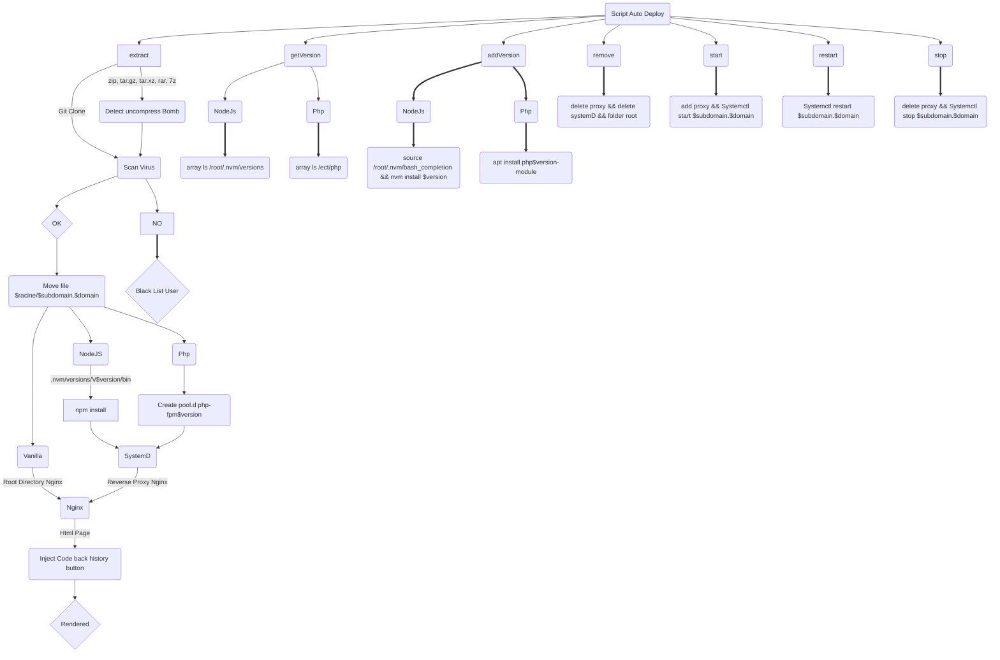

```mermaid
flowchart TD
    auto(Script Auto Deploy)--> Extract
    Extract-->|Git Clone| B
    Extract[extract] -->|zip, tar.gz, tar.xz, rar, 7z| J
    J(Detect uncompress Bomb) --> B(Scan Virus)
    B --> C{OK}
    B --> Z[NO]
    C --> E(Move file $racine/$subdomain.$domain)
    E --> K(Vanilla)
    E --> L(NodeJS)
    L -->|.nvm/versions/V$version/bin| N[npm install]
    E --> M(Php)
    M --> O(Create pool.d php-fpm$version)
    N --> X
    O --> X(SystemD)
    K -->|Root Directory Nginx| Nginx(Nginx)
    X -->|Reverse Proxy Nginx| Nginx(Nginx)
    Nginx -->|Html Page| IJ(Inject Code back history button)
    IJ --> ZZ{Rendered}
    auto-->ver(getVersion)
    ver-->verNode(NodeJs) ==>verNodeR(array ls /root/.nvm/versions)
    ver-->verPhp(Php) ==>verPhpR(array ls /ect/php)
    auto-->addver(addVersion) 
    addver ==> addverNode(NodeJs) ==> addverNodeR(source /root/.nvm/bash_completion && nvm install $version)
    addver ==> addverPhp(Php) ==> addverPhpR(apt install php$version-module)
    auto-->rem(remove) ==> rm(delete proxy && delete systemD && folder root)
    auto-->start(start) ==> st(add proxy && Systemctl start $subdomain.$domain)
    auto-->restart(restart) ==> rst(Systemctl restart $subdomain.$domain)
    auto-->stop(stop) ==> sto(delete proxy && Systemctl stop $subdomain.$domain)
    
    Z ==> bl{Black List User}
```
