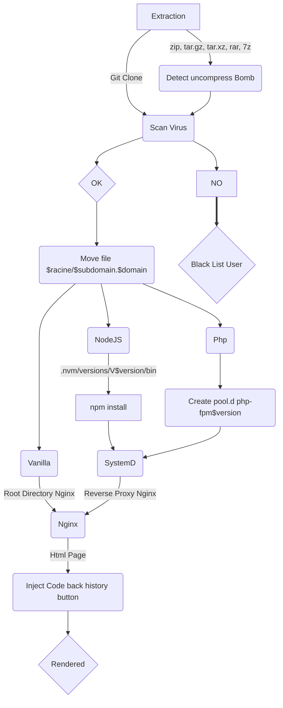

```mermaid
flowchart TD
    A -->|Git Clone| B
    A[Extraction] -->|zip, tar.gz, tar.xz, rar, 7z| J
    J(Detect uncompress Bomb) --> B(Scan Virus)
    B --> C{OK}
    B --> Z[NO]
    C --> E(Move file $racine/$subdomain.$domain)
    E --> K(Vanilla)
    E --> L(NodeJS)
    L -->|.nvm/versions/V$version/bin| N[npm install]
    E --> M(Php)
    M --> O(Create pool.d php-fpm$version)
    N --> X
    O --> X(SystemD)
    K -->|Root Directory Nginx| Nginx(Nginx)
    X -->|Reverse Proxy Nginx| Nginx(Nginx)
    Nginx -->|Html Page| IJ(Inject Code back history button)
    IJ --> ZZ{Rendered}
    

    Z ==> bl{Black List User}
```
